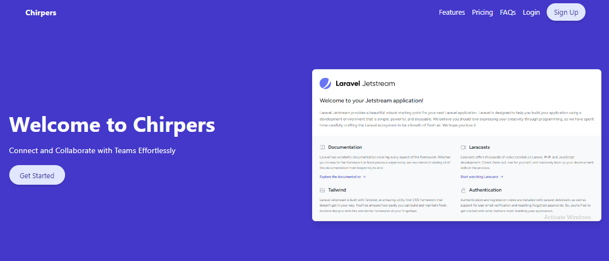
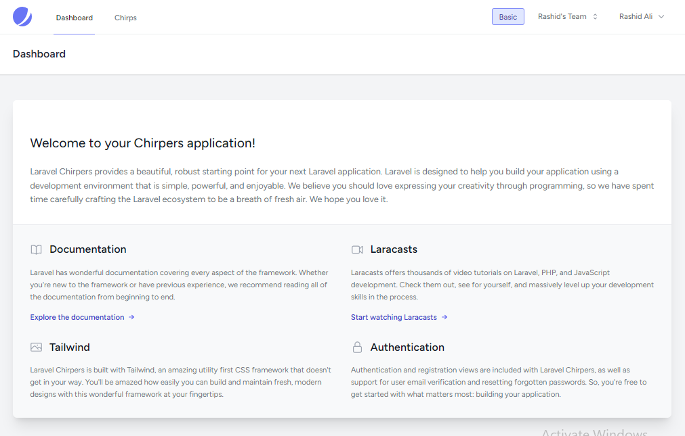
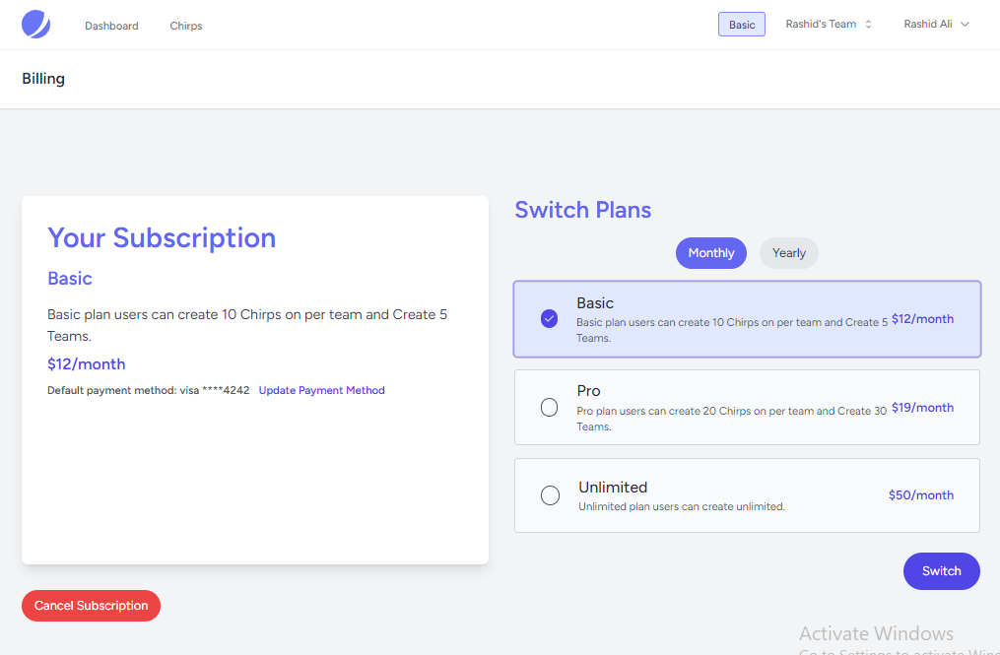
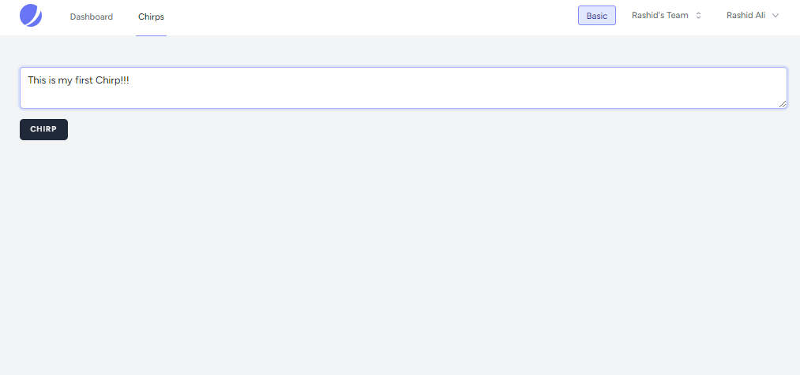

# Chirpers - A Demo Application

## Introduction

Welcome to **Chirpers**, a demo application inspired by the `Laravel Bootcamp`. It showcases the power of the `PlanCraft` package in action. `Chirpers` emulates a social media platform where users can create and manage "Chirps" within teams. `PlanCraft` seamlessly handles user subscriptions and feature access based on their chosen plan.

## Plans in Chirpers

Chirpers offers three distinct subscription plans, each tailored to different user needs:

### Basic Plan
- **Price:** $12/month or $129.6/year (Save 10%)
- **Features:**
  - Create up to 10 Chirps per team
  - Create up to 5 Teams
- **Description:** Basic plan users can create 10 Chirps on each team and have the ability to create up to 5 Teams.

### Pro Plan
- **Price:** $19/month or $205.2/year (Save 10%)
- **Features:**
  - Create up to 20 Chirps per team
  - Create up to 30 Teams
- **Description:** Pro plan users can create 20 Chirps on each team and have the ability to create up to 30 Teams.

### Unlimited Plan
- **Price:** $50/month or $540/year (Save 10%)
- **Features:**
  - Unlimited Chirps
  - Unlimited Teams
- **Description:** Unlimited plan users have no restrictions on Chirps or Teams. Create without limitations!

## Screenshots

### Dashboard

### Billing Page

### Creating a Chirp

## Billing and Subscriptions

### Viewing and Choosing Plans

Users can access the billing section to view and select their preferred subscription plan. The available plans are fetched using `PlanCraft` and displayed with their respective details.

### Subscribing to a Plan

When a user chooses a plan and initiates the subscription process, Chirpers leverages Laravel `Cashier-Stripe` to securely handle payment transactions. The selected plan's details are used to create a new subscription associated with the user.

### Switching Plans

Chirpers allows users to seamlessly switch between plans. The `switchSubscription` method updates the user's subscription with the newly chosen plan.

### Updating Payment Method

Users can easily update their default payment method through the billing interface.

### Cancelling Subscription

If a user decides to cancel their subscription, Chirpers provides a straightforward process. The `cancelSubscription` method ensures a smooth cancellation experience.

## Chirping Away!

With their subscription in place, users can start chirping within their teams. Chirpers utilizes Laravel's Gate and the `checkEligibility` method from `PlanCraft` to enforce limits on chirp creation, providing a seamless experience.

## Get Started with Chirpers

Ready to experience Chirpers for yourself? Follow the steps below to set up the demo application on your local machine:

1. [Clone the Chirpers Repository](get-started.md#step-1-clone-the-repository)
2. [Install Dependencies](get-started.md#step-2-install-dependencies)
3. [Set Up Environment Variables](get-started.md#step-3-set-up-environment-variables)
4. [Generate Application Key](get-started.md#step-4-generate-application-key)
5. [Migrate the Database](get-started.md#step-5-migrate-the-database)
6. [Start the Application](get-started.md#step-7-start-the-application)
7. [Access the Application](get-started.md#step-8-access-the-application)
8. [Explore and Test](get-started.md#step-9-explore-and-test)

[Get Started with Chirpers](get-started.md)

---

Note: This is a simulated demo application and not an actual social media platform.

> Built with the Laravel `Jetstream` starter-kit.
