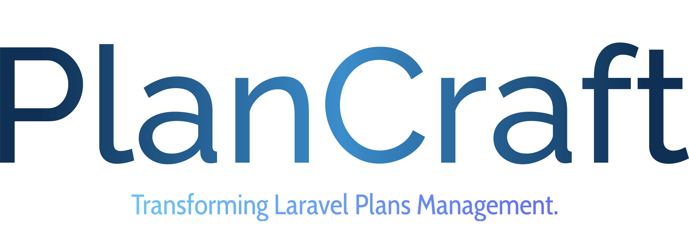

**PlanCraft** is a powerful Laravel package engineered to revolutionize how you manage subscription plans and features within your Laravel SaaS application. Say goodbye to the hassle of **database** wrangling and tedious queries! **PlanCraft** is your shortcut to seamless plan creation in Laravel. No more **tables**, no more **queries** - just pure, unadulterated efficiency.

## Crafting Plans, Effortlessly 🎨

With **PlanCraft**, creating plans in your Laravel SaaS application is a breeze. No need to clutter your **database** with extra **tables**. No more endless queries just to fetch and display plans. It's like having a master craftsman at your fingertips, turning complex tasks into elegant solutions.

## Embrace a New Era in Laravel Plans 🌟

**PlanCraft** isn't just a package; it's a revolution. Elevate your Laravel SaaS application to new heights with a solution inspired by the ingenuity of Laravel Jetstream's roles and permissions system. Say goodbye to complicated setups and hello to a future where managing subscription plans is as smooth as a summer breeze.

## Features 🎛️

### Plan Management 📝

Craft subscription plans effortlessly. With **PlanCraft**, define them directly in the PlanCraftServiceProvider - no more wrestling with databases. It's subscription management made seamless!

### Feature Control 🔧

Effortlessly navigate the intricate landscape of feature creation, management, and assignment within your subscription plans with **PlanCraft**.
Say goodbye to tedious tasks and hello to a world where every interaction is a symphony of efficiency and precision.

### Sophisticated Eligibility Checks 🔍

Need to implement intricate eligibility checks based on subscription levels? **PlanCraft** has you covered. Perform advanced eligibility checks for specific features, ensuring that your subscribers have access to the right functionalities at the right subscription tiers.

### Database-Less Plans ✨

Gone are the days of relying on extensive database storage for plans. **PlanCraft** empowers you to define plans directly within the PlanCraftServiceProvider. This innovative approach eliminates the need for database storage, streamlining your application's subscription workflow.

## Getting Started 🛫

Ready to unleash the power of **PlanCraft**? Dive into our comprehensive documentation and get started today!

- [Installation Guide](/guide/installation.md)
- [Usage Instructions](/usage/usage.md)
- [Demo App](/demo/demo.md)

## Support My Work ☕

If you find PlanCraft helpful and would like to support my work, you can buy me a coffee. Your support will help keep this project alive and thriving. It's a small token of appreciation that goes a long way.

## License 🔐

**PlanCraft** is open-sourced software licensed under the MIT License (MIT). Please see [License File](https://github.com/realrashid/plan-craft/blob/main/LICENSE.md) for more information.

 

 <b>Made with ❤️ from Pakistan</b> 

